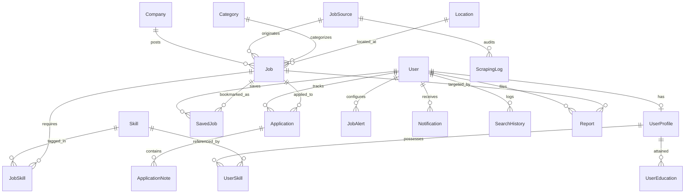

# CareerHunt — Database Design & Entity Relationship Specification

## 1. Overview
The database design for CareerHunt adheres to **3NF normalization** standards, enforces referential integrity through explicit foreign keys and constraints, and utilizes strategic composite and single-field indexes for high-speed search and filtering.

---

## 2. Entity-Relationship Diagram (ERD)

---

## 3. Detailed Entity Schemas

### 3.1 Authentication & Profile Domain (`apps.accounts`)

#### `User` (Django `auth.models.User` or Custom AbstractUser)
- `id`: BigAutoField, Primary Key
- `username`: CharField(150), Unique
- `email`: EmailField(254), Unique, Indexed
- `password`: CharField(128) (Hashed PBKDF2/Argon2)
- `first_name`: CharField(150)
- `last_name`: CharField(150)
- `is_staff`: BooleanField, Default=False
- `is_active`: BooleanField, Default=True
- `date_joined`: DateTimeField, Auto_now_add=True

#### `UserProfile`
- `id`: BigAutoField, Primary Key
- `user`: OneToOneField(User, on_delete=CASCADE, related_name="profile")
- `headline`: CharField(255), Blank=True
- `phone`: CharField(30), Blank=True
- `location`: CharField(150), Blank=True
- `bio`: TextField, Blank=True
- `experience_level`: CharField(20), Choices: `['fresher', '0-1', '1-2', '2+']`, Default='fresher'
- `preferred_job_types`: JSONField (Array of choices: `['internship', 'full-time', ...]`)
- `preferred_locations`: JSONField (Array of city names)
- `preferred_work_mode`: CharField(20), Choices: `['on-site', 'remote', 'hybrid', 'any']`, Default='any'
- `expected_salary_min`: DecimalField(12, 2), Null=True, Blank=True
- `resume`: FileField(upload_to="resumes/%Y/%m/"), Null=True, Blank=True
- `created_at`: DateTimeField(auto_now_add=True)
- `updated_at`: DateTimeField(auto_now=True)

#### `UserEducation`
- `id`: BigAutoField, Primary Key
- `profile`: ForeignKey(UserProfile, on_delete=CASCADE, related_name="educations")
- `degree`: CharField(150) (e.g. B.Tech Computer Science, BCA)
- `institution`: CharField(255)
- `start_year`: PositiveSmallIntegerField()
- `end_year`: PositiveSmallIntegerField()
- `grade_or_cgpa`: CharField(50), Blank=True

#### `UserSkill`
- `id`: BigAutoField, Primary Key
- `profile`: ForeignKey(UserProfile, on_delete=CASCADE, related_name="user_skills")
- `skill`: ForeignKey(Skill, on_delete=CASCADE, related_name="skilled_users")
- `proficiency`: CharField(20), Choices: `['beginner', 'intermediate', 'advanced']`, Default='intermediate'
- *Unique Constraint:* `['profile', 'skill']`

---

### 3.2 Opportunity & Taxonomy Domain (`apps.jobs`, `apps.companies`, `apps.sources`)

#### `Company`
- `id`: BigAutoField, Primary Key
- `name`: CharField(255), Unique, Indexed
- `slug`: SlugField(255), Unique
- `website`: URLField(500), Blank=True
- `logo`: ImageField(upload_to="companies/logos/", Blank=True, Null=True)
- `description`: TextField, Blank=True
- `industry`: CharField(100), Blank=True
- `headquarters`: CharField(150), Blank=True
- `is_verified`: BooleanField, Default=False
- `created_at`: DateTimeField(auto_now_add=True)

#### `Category`
- `id`: BigAutoField, Primary Key
- `name`: CharField(100), Unique
- `slug`: SlugField(100), Unique
- `description`: TextField, Blank=True
- `icon`: CharField(50), Blank=True

#### `Skill`
- `id`: BigAutoField, Primary Key
- `name`: CharField(100), Unique, Indexed
- `slug`: SlugField(100), Unique
- `category`: ForeignKey(Category, on_delete=SET_NULL, null=True, blank=True)

#### `JobSource`
- `id`: BigAutoField, Primary Key
- `name`: CharField(255), Unique
- `source_type`: CharField(50), Choices: `['official_company', 'government', 'authorized_api', 'rss_feed', 'job_board', 'manual_admin']`
- `source_url`: URLField(500)
- `status`: CharField(20), Choices: `['active', 'degraded', 'failing', 'inactive']`, Default='active'
- `is_verified`: BooleanField, Default=True
- `last_checked_at`: DateTimeField(null=True, blank=True)
- `total_jobs_collected`: PositiveIntegerField(default=0)
- `error_count`: PositiveIntegerField(default=0)
- `created_at`: DateTimeField(auto_now_add=True)

#### `Job` (The Central Opportunity Model)
- `id`: BigAutoField, Primary Key
- `title`: CharField(255), Indexed
- `slug`: SlugField(280), Unique, Indexed
- `company`: ForeignKey(Company, on_delete=CASCADE, related_name="jobs")
- `category`: ForeignKey(Category, on_delete=SET_NULL, null=True, blank=True, related_name="jobs")
- `source`: ForeignKey(JobSource, on_delete=PROTECT, related_name="jobs")
- `external_id`: CharField(255), Blank=True, Indexed
- `source_url`: URLField(1000)
- `application_url`: URLField(1000), Indexed
- `description`: TextField()
- `requirements`: TextField(blank=True)
- `opportunity_type`: CharField(30), Choices: `['internship', 'full-time', 'part-time', 'apprenticeship', 'graduate-program', 'trainee', 'contract']`, Indexed
- `experience_level`: CharField(20), Choices: `['fresher', '0-1', '1-2', '2+']`, Indexed
- `remote_type`: CharField(20), Choices: `['on-site', 'remote', 'hybrid']`, Indexed
- `location_name`: CharField(150), Indexed
- `salary_min`: DecimalField(12, 2), Null=True, Blank=True
- `salary_max`: DecimalField(12, 2), Null=True, Blank=True
- `salary_currency`: CharField(10), Default='INR'
- `is_salary_disclosed`: BooleanField(default=False)
- `status`: CharField(20), Choices: `['upcoming', 'active', 'closing-soon', 'expired', 'closed']`, Default='active', Indexed
- `verification_status`: CharField(20), Choices: `['verified', 'pending-review', 'reported', 'unverified']`, Default='verified', Indexed
- `posted_at`: DateTimeField(default=timezone.now, Indexed=True)
- `application_open_date`: DateTimeField(null=True, blank=True, Indexed=True)
- `application_deadline`: DateTimeField(null=True, blank=True, Indexed=True)
- `last_checked_at`: DateTimeField(default=timezone.now)
- `created_at`: DateTimeField(auto_now_add=True)
- `updated_at`: DateTimeField(auto_now=True)
- *Indexes:*
  - Composite Index: `['status', 'opportunity_type', 'experience_level']`
  - Composite Index: `['status', 'application_deadline']`
  - Composite Index: `['company', 'title']`
- *Unique Constraints:*
  - Deduplication Constraint: `['source', 'external_id']` (where external_id is not empty)

#### `JobSkill`
- `id`: BigAutoField, Primary Key
- `job`: ForeignKey(Job, on_delete=CASCADE, related_name="job_skills")
- `skill`: ForeignKey(Skill, on_delete=CASCADE, related_name="skill_jobs")
- `is_mandatory`: BooleanField(default=True)
- *Unique Constraint:* `['job', 'skill']`

---

### 3.3 User Engagement Domain (`apps.applications`, `apps.notifications`, `apps.reports`)

#### `SavedJob`
- `id`: BigAutoField, Primary Key
- `user`: ForeignKey(User, on_delete=CASCADE, related_name="saved_jobs")
- `job`: ForeignKey(Job, on_delete=CASCADE, related_name="saved_by_users")
- `created_at`: DateTimeField(auto_now_add=True)
- *Unique Constraint:* `['user', 'job']`

#### `Application`
- `id`: BigAutoField, Primary Key
- `user`: ForeignKey(User, on_delete=CASCADE, related_name="applications")
- `job`: ForeignKey(Job, on_delete=CASCADE, related_name="candidate_applications")
- `status`: CharField(25), Choices: `['saved', 'applied', 'assessment', 'interview', 'offer', 'rejected', 'withdrawn']`, Default='applied', Indexed
- `applied_date`: DateField(null=True, blank=True)
- `interview_date`: DateTimeField(null=True, blank=True)
- `follow_up_date`: DateField(null=True, blank=True)
- `notes`: TextField(blank=True)
- `created_at`: DateTimeField(auto_now_add=True)
- `updated_at`: DateTimeField(auto_now=True)
- *Unique Constraint:* `['user', 'job']`

#### `JobAlert`
- `id`: BigAutoField, Primary Key
- `user`: ForeignKey(User, on_delete=CASCADE, related_name="job_alerts")
- `name`: CharField(150)
- `keywords`: CharField(255), Blank=True
- `location`: CharField(150), Blank=True
- `opportunity_type`: CharField(30), Blank=True
- `experience_level`: CharField(20), Blank=True
- `is_active`: BooleanField(default=True)
- `frequency`: CharField(20), Choices: `['instant', 'daily', 'weekly']`, Default='daily'
- `last_sent_at`: DateTimeField(null=True, blank=True)
- `created_at`: DateTimeField(auto_now_add=True)

#### `Notification`
- `id`: BigAutoField, Primary Key
- `user`: ForeignKey(User, on_delete=CASCADE, related_name="notifications")
- `title`: CharField(255)
- `message`: TextField()
- `notification_type`: CharField(30), Choices: `['job_alert', 'deadline_approaching', 'application_status', 'system']`
- `target_url`: CharField(500), Blank=True
- `is_read`: BooleanField(default=False, Indexed=True)
- `created_at`: DateTimeField(auto_now_add=True)

#### `Report`
- `id`: BigAutoField, Primary Key
- `job`: ForeignKey(Job, on_delete=CASCADE, related_name="reports")
- `reported_by`: ForeignKey(User, on_delete=SET_NULL, null=True, blank=True, related_name="submitted_reports")
- `reason`: CharField(50), Choices: `['suspicious_link', 'requesting_money', 'incorrect_information', 'expired_opportunity', 'fake_company', 'duplicate_listing', 'other']`
- `details`: TextField(blank=True)
- `status`: CharField(20), Choices: `['pending', 'investigating', 'resolved', 'dismissed']`, Default='pending', Indexed
- `admin_notes`: TextField(blank=True)
- `reviewed_by`: ForeignKey(User, on_delete=SET_NULL, null=True, blank=True, related_name="reviewed_reports")
- `created_at`: DateTimeField(auto_now_add=True)
- `resolved_at`: DateTimeField(null=True, blank=True)

---

### 3.4 Ingestion & Monitoring Domain (`apps.sources`)

#### `ScrapingLog`
- `id`: BigAutoField, Primary Key
- `source`: ForeignKey(JobSource, on_delete=CASCADE, related_name="logs")
- `status`: CharField(20), Choices: `['started', 'success', 'warning', 'failed']`
- `items_fetched`: PositiveIntegerField(default=0)
- `items_created`: PositiveIntegerField(default=0)
- `items_updated`: PositiveIntegerField(default=0)
- `items_skipped`: PositiveIntegerField(default=0)
- `duration_seconds`: FloatField(default=0.0)
- `error_message`: TextField(blank=True)
- `created_at`: DateTimeField(auto_now_add=True)
